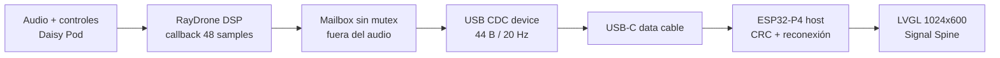

# P4SlaveDaisy

Superficie visual dedicada de **RayDrone** para la Guition
**JC1060P470C**: ESP32-P4, LCD táctil MIPI-DSI de 7 pulgadas (1024×600,
JD9165BA) y GT911.

El proyecto compila de forma independiente con PlatformIO. La P4 actúa como
host USB CDC; Daisy Seed actúa como dispositivo y publica el estado del audio
a 20 Hz. La primera versión es deliberadamente de solo lectura: el táctil está
inicializado, pero ningún elemento finge modificar parámetros que todavía son
autoridad de los controles físicos de Daisy Pod.

## Estado verificado

- Build `esp32p4`: **correcto** con pioarduino/Arduino-ESP32 3.3.7 y LVGL
  8.3.11.
- RAM interna: **30.648 bytes / 327.680 bytes (9,4 %)**.
- Flash de aplicación: **766.820 bytes / 6.553.600 bytes (11,7 %)**.
- Driver `usb_host_cdc_acm` 2.4.0 incluido localmente para que no dependa de
  archivos ocultos de BlueSlaveP4.
- Falta la prueba eléctrica extremo a extremo en las dos placas reales.

## Arquitectura



El paquete contiene secuencia, flags, muestras grabadas/capacidad, Character,
Intensity, Focus, ganancia del limitador, niveles de entrada/salida, voces,
acorde y sample rate. Tiene magic `RD`, versión, longitud y CRC-16/CCITT-FALSE.
Si USB está ocupado, Daisy descarta ese refresco visual; nunca espera desde el
callback de audio.

## Cableado USB-C

La JC1060P470C tiene dos Type-C, identificados como **Full-speed** y
**High-speed**. Para esta implementación:

1. Alimenta/programa la P4 por el Type-C **Full-speed** habitual.
2. Conecta el Type-C **High-speed / USB-OTG** de la P4 al USB-C integrado de
   Daisy Seed con un cable USB-C de **datos**, no uno de solo carga.
3. Para la primera prueba, deja que el host P4 alimente Daisy por ese enlace y
   evita conectar otra fuente USB simultánea a Daisy.
4. Audio IN/OUT permanece en Daisy Pod; USB solo lleva telemetría.

No conectes el puerto host/OTG de la P4 a un PC. Si la serigrafía de tu revisión
de placa no distingue `FS` y `HS`, verifica el diagrama del fabricante antes de
probar: no basta con escoger el conector que “parece libre”.

## Preparar Daisy

Usa el firmware RayDrone normal, que se compila como `BOOT_SRAM` y lleva USB
CDC activado:

```powershell
cd C:\Users\cesco\Documents\Arduino\XboxBLE\DaisyPod_Aurora_repo\raydrone
.\build.ps1 -Clean
.\flash.ps1
```

El perfil `build.ps1 -Direct` es un firmware de recuperación sin USB: ya ocupa
el 93,60 % de la flash interna y la pila CDC no cabe de forma segura.

## Compilar y cargar P4

```powershell
cd C:\Users\cesco\Documents\Arduino\XboxBLE\P4SlaveDaisy
C:\Users\cesco\.platformio\penv\Scripts\platformio.exe run -e esp32p4
C:\Users\cesco\.platformio\penv\Scripts\platformio.exe run -e esp32p4 -t upload
```

`platformio.ini` usa `COM21`, igual que BlueSlaveP4. Cámbialo si Windows asigna
otro puerto. Para monitor serie:

```powershell
C:\Users\cesco\.platformio\penv\Scripts\platformio.exe device monitor -b 115200 -p COM21
```

## Qué debe verse

- `BUSCANDO DAISY`: no hay dispositivo CDC enumerado.
- `USB LISTO / SIN DATOS`: Daisy aparece como `0483:5740`, pero aún no llegó
  ningún paquete válido; comprueba que has flasheado el firmware normal.
- `CONECTADO`: ruta turquesa en movimiento y valores actualizados.
- `SENAL PERDIDA`: el cable se retiró después de recibir datos o la telemetría
  lleva más de 750 ms parada; los últimos valores quedan atenuados y la UI pide
  revisar USB-C.
- `FREEZE`, `BYPASS` y `LIMIT` se muestran solo cuando Daisy publica esos
  estados reales.

## Estructura

```text
P4SlaveDaisy/
├── include/
│   ├── config.h                    Pines y constantes de placa
│   ├── lv_conf.h                   LVGL en PSRAM
│   └── raydrone_usb_protocol.h     Contrato binario compartido
├── lib/usb_host_cdc_acm/           Driver Espressif vendorado
├── src/
│   ├── drivers/                    JD9165BA, MIPI-DSI, VSYNC y GT911
│   ├── ui/dashboard.cpp            Interfaz Signal Spine
│   ├── raydrone_link.cpp           Parser, CRC y modelo de conexión
│   ├── usb_cdc_handler.cpp         Host CDC y reconexión
│   └── main.cpp                    Orquestación a 20 Hz
├── DESIGN.md                       Sistema visual y estados
├── PRODUCT.md                      Verdad y límites del producto
└── platformio.ini
```

## Hardware de referencia

La documentación de la placa enumera sus dos puertos Type-C y las interfaces
USB 2.0 OTG. La implementación host sigue el driver oficial de Espressif para
ESP32-P4 y conserva el componente CDC-ACM bajo Apache-2.0.
