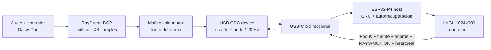

# P4SlaveDaisy

Superficie visual dedicada de **RayDrone** para la Guition
**JC1060P470C**: ESP32-P4, LCD táctil MIPI-DSI de 7 pulgadas (1024×600,
JD9165BA) y GT911.

El proyecto compila de forma independiente con PlatformIO. La P4 actúa como
host USB CDC; Daisy Seed actúa como dispositivo y publica el estado del audio
a 20 Hz. La forma de onda central representa el sampler o el ring `LINE IN`
continuo; tocar o arrastrar sobre ella mueve el **Focus** real de RayDrone. La
pantalla también selecciona LIVE/Freeze, memoria persistente, samplers SD, los
diez acordes/voicings, **RAYS / MOTION** y los perfiles de audio
**48K PERFORMANCE / 96K ULTRA**.

## Estado verificado

- Build `esp32p4`: **correcto** con pioarduino/Arduino-ESP32 3.3.7 y LVGL
  8.3.11.
- RAM interna: **31.536 bytes / 327.680 bytes (9,6 %)**.
- Flash de aplicación: **713.046 bytes / 6.553.600 bytes (10,9 %)**.
- Driver `usb_host_cdc_acm` 2.4.0 incluido localmente para que no dependa de
  archivos ocultos de BlueSlaveP4.
- Falta la prueba eléctrica extremo a extremo en las dos placas reales.

## Arquitectura



El paquete de estado v3 de 58 bytes contiene secuencia, flags, muestras grabadas/capacidad, Character,
Intensity, Focus, ganancia del limitador, niveles de entrada/salida, voces,
acorde, material, RAYS, modo/destino/profundidad/velocidad de MOTION,
sample rate de la fuente, sample rate del motor, carga CPU,
fuente (`DEFAULT`, `LIVE`, `FREEZE`, memoria o SD) y escena
(`DRONE`/`SHIMMER`). Tiene magic `RD`, versión, longitud y
CRC-16/CCITT-FALSE. La envolvente de 96 columnas viaja como cuatro paquetes de
64 bytes; en LIVE se actualiza un cuarto cada 50 ms y el barrido completo tarda
unos 200 ms. Los comandos táctiles ocupan 16 bytes.
Si USB está ocupado, Daisy descarta ese refresco visual; nunca espera desde el
callback de audio.

P4 envía `SYNC` cada segundo. Si el handle CDC sigue enumerado pero no recibe
telemetría durante 8 s, cierra y reabre solo la función CDC; no reinicia la
pantalla y conserva los últimos valores mientras recupera el enlace. Una pausa
breve del DSP no dispara esa recuperación.

## Cableado USB-C

La JC1060P470C tiene dos Type-C, identificados como **Full-speed** y
**High-speed**. Para esta implementación:

1. Alimenta/programa la P4 por el Type-C **Full-speed** habitual.
2. Conecta el Type-C **High-speed / USB-OTG** de la P4 al USB-C integrado de
   Daisy Seed con un cable USB-C de **datos**, no uno de solo carga.
3. Para la primera prueba, deja que el host P4 alimente Daisy por ese enlace y
   evita conectar otra fuente USB simultánea a Daisy.
4. Audio IN/OUT permanece en Daisy Pod; USB solo lleva telemetría.

No conectes el puerto host/OTG de la P4 a un PC. Si la serigrafía de tu revisión
de placa no distingue `FS` y `HS`, verifica el diagrama del fabricante antes de
probar: no basta con escoger el conector que “parece libre”.

## Preparar Daisy

Usa el firmware RayDrone normal, que se compila como `BOOT_SRAM` y lleva USB
CDC activado:

```powershell
cd C:\Users\cesco\Documents\Arduino\XboxBLE\DaisyPod_Aurora_repo\raydrone
.\build.ps1 -Clean
.\flash.ps1
```

El perfil `build.ps1 -Direct` es un firmware de recuperación fijo a 48 kHz,
sin USB ni storage. El selector solo existe en el firmware normal.

## Compilar y cargar P4

```powershell
cd C:\Users\cesco\Documents\Arduino\XboxBLE\P4SlaveDaisy
C:\Users\cesco\.platformio\penv\Scripts\platformio.exe run -e esp32p4
C:\Users\cesco\.platformio\penv\Scripts\platformio.exe run -e esp32p4 -t upload
```

Desde VS Code, la tarea **RayDrone: Actualizar Daisy + P4** compila y flashea
primero RayDrone en Daisy y después carga P4SlaveDaisy. Es la opción recomendada
cuando cambia el protocolo: sigue en el terminal la indicación RESET/BOOT de
Daisy cuando aparezca.

`platformio.ini` usa `COM21`, igual que BlueSlaveP4. Cámbialo si Windows asigna
otro puerto. Para monitor serie:

```powershell
C:\Users\cesco\.platformio\penv\Scripts\platformio.exe device monitor -b 115200 -p COM21
```

## Qué debe verse

- `BUSCANDO DAISY`: no hay dispositivo CDC enumerado.
- `USB LISTO / SIN DATOS`: Daisy aparece como `0483:5740`, pero aún no llegó
  ningún paquete válido; comprueba que has flasheado el firmware normal.
- `CONECTADO`: ruta turquesa en movimiento y valores actualizados.
- `ACTUALIZA DAISY`: la conexión funciona, pero Daisy aún ejecuta un firmware
  anterior que no anuncia todos los controles táctiles.
- `SENAL PERDIDA`: el cable se retiró o la telemetría lleva más de 750 ms
  parada; los últimos valores quedan atenuados y comienza la recuperación CDC.
- `DEFAULT.MP3`, `CAPTURA LIVE`, `DRONE`, `SHIMMER`, `BYPASS` y `LIMIT` se
  muestran solo cuando Daisy publica esos estados reales.
- La onda turquesa corresponde al sampler por defecto; la ámbar, a Line In.
  El needle ámbar y su ventana siguen el Focus y Character reales.
- En LIVE, la onda y el cabezal turquesa avanzan casi en tiempo real. Focus solo
  recorre la parte válida y segura del ring de 12 segundos.
- **DEFAULT** recupera el sampler original; **LIVE** activa la entrada continua;
  **FREEZE** congela y guarda; **MEM** recarga la copia QSPI; **SD NEXT** avanza
  por `RAYDRONE/*.wav`; **SAVE** vuelve a guardar el sampler actual.
- Tocar **ACORDE** abre diez botones grandes; la selección se aplica en Daisy y
  el bloque principal conserva siempre el voicing confirmado por telemetría.
  El botón elegido queda ámbar mientras P4 reintenta; el panel solo se cierra
  cuando Daisy devuelve el nuevo acorde. Si no responde, aparece
  `SIN CONFIRMAR` y permite reintentar.
- Tocar **CAMPO DE GRANOS** abre RAYS/MOTION. RAYS ofrece 24, 28, 32, 40 y 48
  voces objetivo. MOTION ofrece OFF, SLOW, SMOOTH, S&H, BROWNIAN y QMC sobre
  FOCUS, SPREAD, DENSITY o SPACE, con sliders AMOUNT/SPEED. La modulación se
  genera una vez por bloque dentro de Daisy; P4 solo envía configuración y
  espera la confirmación telemétrica.
- El séptimo botón muestra `48K` en turquesa o `96K ULTRA` en ámbar. Al tocarlo
  cambia el motor y guarda la preferencia para el próximo encendido. El pie
  muestra también `CPU xx%`; Daisy adapta la densidad si se acerca al límite.
- `VACIO`, `METAL`, `MADERA`, `CRISTAL`, `AGUA` y `PLASMA` muestran el material
  elegido con el encoder de Daisy Pod.

## Estructura

```text
P4SlaveDaisy/
├── include/
│   ├── config.h                    Pines y constantes de placa
│   ├── lv_conf.h                   LVGL en PSRAM
│   └── raydrone_usb_protocol.h     Contrato binario compartido
├── lib/usb_host_cdc_acm/           Driver Espressif vendorado
├── src/
│   ├── drivers/                    JD9165BA, MIPI-DSI, VSYNC y GT911
│   ├── ui/dashboard.cpp            Interfaz Signal Spine
│   ├── raydrone_link.cpp           Parser, CRC y modelo de conexión
│   ├── usb_cdc_handler.cpp         Host CDC y reconexión
│   └── main.cpp                    Orquestación a 20 Hz
├── DESIGN.md                       Sistema visual y estados
├── PRODUCT.md                      Verdad y límites del producto
└── platformio.ini
```

## Hardware de referencia

La documentación de la placa enumera sus dos puertos Type-C y las interfaces
USB 2.0 OTG. La implementación host sigue el driver oficial de Espressif para
ESP32-P4 y conserva el componente CDC-ACM bajo Apache-2.0.
